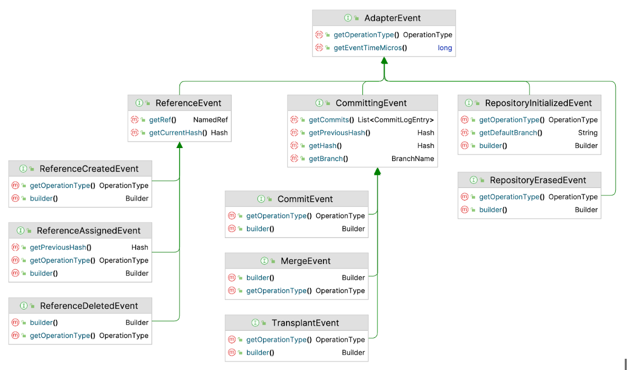
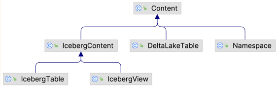
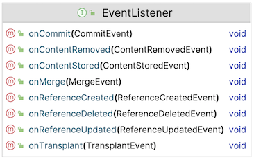

Nessie Events Notification System
=================================

# 1. Overview

This document summarizes the required work to define and implement an event delivery system for Nessie.

This new feature would allow external actors to register themselves as subscribers for events published by Nessie. Such
events could be: a commit, a merge, a transplant, a change to a named reference, a change to a table or view, etc. (A
strict definition of what an event is should be part of this effort.)

Possible use cases include, but are not limited to, automatic data cleanup or optimization. E.g. when a table is
deleted, then some cleanup job could be executed automatically.

## 1.1. Goals & Non-goals

The following should be considered primary goals:

1. Define which types of events we want notifications for;
2. Design and implement changes in Nessie internals;
3. Provide a Service Provider Interface (SPI) that users would need to implement in order to receive Nessie events;
4. Design and implement a reference implementation of this new SPI.

However, we should strive to keep this system as simple as it can be:

1. This new system would be deployed as part of Nessie, not as a separate process;
2. It would have no requirements on external systems;
3. It would not require changes to Nessie's REST API;
4. It would be technology-agnostic.

## 1.2. Previous work

There is a previous Nessie PR with a design doc proposing a similar feature: [#3387]. This PR is now considered
obsolete, but some of its ideas were reused in the present design document.

[#3387]:https://github.com/projectnessie/nessie/pull/3387

Moreover, there is already a rudimentary Event API in Nessie. The `AbstractDatabaseAdapter` class has the notion of an
`AdapterEvent` interface, which currently has the following child types:

This API is internal and only used for tests. Besides, it comes with the following caveat: "[this API is] 'Nessie
internal' and may change, even fundamentally, w/o prior notice." As a consequence, this API will remain, but will not
be modified and will not serve as the foundation for the new Event API that this work will create, even if they will
certainly share some common philosophy. Also, this API delivers events synchronously, which is not what we want for the
new system, as explained below.

And finally, the present document assumes that Nessie's new storage model will be adopted before the work on this
feature starts, and thus takes the new model into account whenever appropriate.

# 2. Design principles

## 2.1. Events

An event, in the scope of this document, is defined as _the act of modifying the catalog state_.

First corollary of this definition: a read of the catalog state is not an event.

Also, an event should only be triggered if the catalog was effectively modified. E.g., if a commit operation could not 
be carried out due to a concurrent modification of the branch, no event should be raised, since the operation did not 
modify the catalog state (but the concurrent modification, if succeeded, triggered such an event).

A complete list of supported event types is given below, but it's important to first discuss the different event 
categories that should be covered by the new system:

### 2.1.1. "Git-like" events

Since Nessie is a Git-like transactional catalog at its core, events in this category are Nessie's primary events.

Git-like events can be further divided into 2 sub-categories:

1. **Reference events**: a reference event is the act of manipulating a named reference; in other words, it's the act of
   moving or creating pointers to existing hashes. These are:
   1. Branch events: when a branch is created, reassigned to a new hash, or deleted;
   2. Tag events: when a tag is created, reassigned to a new hash, or deleted;
2. **"Committing" events**: the act of adding new hashes to the catalog. There are three concrete committing events:
   1. Commit events: probably the most central event type, the commit event is triggered by an API call to a commit
      endpoint.
   2. Merge events: a merge event is triggered by an API call to a merge endpoint.
   3. Transplant events: a transplant event is triggered by an API call to a transplant endpoint.

Notes:

* Git-like events are rather "low-level" events. Most subscribers of the new system would probably not subscribe
  directly to these events, but rather to more high-level events (see below); however, Git-like events could prove
  useful e.g. to feed an external auditing system or to propagate events to 3rd-party/external systems.
* Git-like events have a close relationship to API calls and are almost always triggered by such calls. Only a few 
  Git-like events are exceptionally triggered outside an API call, e.g. when the default branch is initialized.
* All committing events can reference multiple operations (PUTs and DELETEs), and theoretically, multiple tables or 
  views. Therefore, a committing event should be accompanied by zero, one or multiple content-related events, one for 
  each table or view affected; see below. (Events for empty commits are possible, e.g. with empty merges.)
* The new storage model opens up the notion of "references" to be a generic pointer to any kind of stored object. 
  Other reference events could be defined when other types of references will be accessible to end users through 
  Nessie's API. At the time of writing though, only branches and tags are exposed.
* The new storage model has the notion of "internal" commits (e.g. when initializing the catalog): these will not 
  trigger commit events.
* The new storage model also defines more object types that can be stored by Nessie: enhanced tags (e.g. signed tags, 
  custom tag message, et al), strings, etc. For the MVP at least, these objects should not trigger events.

### 2.1.2. Content-related events

Content-related events notify subscribers of changes to an entity in the catalog, such as a namespace, a table or a 
view.

The default, built-in contents in Nessie share the following common base:

But contents in Nessie are pluggable; because of that, Nessie cannot inspect two arbitrary Content instances and
determine what has been changed. Content-related events must therefore remain generic enough to convey changes affecting
any kind of content. For that, they will include the content affected by the change; but it will be the responsibility
of each consumer to analyze the event in order to understand what changed.

Notes:

* Content-related events are mostly suitable for functional use cases. It is expected that most subscribers will 
  subscribe to such events.
* Repository events (e.g. repository initialized, repository deleted) are currently not in scope; this can be 
  reevaluated in the future.

### 2.1.4. Event types (full list)

Here is the complete list of proposed event types and event attributes. Unqualified class names in the table below
reference the `org.projectnessie.model` package.

<table>
  <tbody>
    <tr>
      <td><strong>Category</strong></td>
      <td><strong>Sub-category</strong></td>
      <td><strong>Event type</strong></td>
      <td><strong>Triggered by</strong></td>
      <td><strong>Specific event attributes</strong></td>
      <td><strong>Comments</strong></td>
    </tr>
    <tr>
      <td rowspan="6">Git-like events</td>
      <td rowspan="3">Reference events</td>
      <td><code>REFERENCE_CREATED</code></td>
      <td>API call</td>
      <td>
        <ul>
          <li>Reference name</li>
          <li>Reference type (Branch, Tag...)</li>
          <li>New HEAD</li>
        </ul>
      </td>
      <td>In all reference events, the reference name should be included in short form 
          (e.g. <code>branch1</code>) and in full form (e.g. <code>/refs/heads/branch1</code>)</td>
    </tr>
    <tr>
      <td><code>REFERENCE_UPDATED</code></td>
      <td>API call</td>
      <td>
        <ul>
          <li>Reference name</li>
          <li>Reference type (Branch, Tag...)</li>
          <li>Previous HEAD</li>
          <li>New HEAD</li>
        </ul>
      </td>
      <td>I.e., reassigned to a different hash, through an API call exclusively. Indirect reference updates due to a commit 
          do not trigger this event.</td>
    </tr>
    <tr>
      <td><code>REFERENCE_DELETED</code></td>
      <td>API call</td>
      <td>
        <ul>
          <li>Reference name</li>
          <li>Reference type (Branch, Tag...)</li>
          <li>Previous HEAD</li>
        </ul>
      </td>
      <td>&nbsp;</td>
    </tr>
    <tr>
      <td rowspan="3">Committing events</td>
      <td><code>COMMIT</code></td>
      <td>API call</td>
      <td>
        <ul>
          <li>Branch name</li>
          <li>Previous HEAD</li>
          <li>New HEAD</li>
          <li><code>CommitMeta</code> object</li>
          <li>Operations (list of PUTs and DELETEs)</li>
        </ul>
      </td>
      <td>Operations are listed in summarized form (only keys without contents), in order to avoid huge event payloads. 
          Full operation contents are sent separately in content-related events.
        
A <code>COMMIT</code> event should trigger:

        <ul>
          <li>0-N content events (one for each PUT/DELETE operation).</li>
        </ul>
      </td>
    </tr>
    <tr>
      <td><code>MERGE</code></td>
      <td>API call</td>
      <td>
        <ul>
          <li>Source branch name</li>
          <li>Source branch HEAD</li>
          <li>Target branch name</li>
          <li>Previous target branch HEAD</li>
          <li>New target branch HEAD</li>
          <li>Common ancestor hash</li>
        </ul>
      </td>
      <td>Operations (PUTs and DELETEs) are not included, in order to avoid huge event payloads. 
          Full operation contents are sent separately as content-related events.
        
A <code>MERGE</code> event should trigger:

        <ul>
          <li>0-N content events (one for each global PUT/DELETE operation, excluding intermediary operations).</li>
        </ul>
      </td>
    </tr>
    <tr>
      <td><code>TRANSPLANT</code></td>
      <td>API call</td>
      <td>
        <ul>
          <li>Source branch name</li>
          <li>Target branch name</li>
          <li>Previous target branch HEAD</li>
          <li>New target branch HEAD</li>
        </ul>
      </td>
      <td>Operations (PUTs and DELETEs) are not included, in order to avoid huge event payloads. 
          Full operation contents are sent separately as content-related events.
        
A <code>TRANSPLANT</code> event should trigger:

        <ul>
          <li>0-N content events (one for each global PUT/DELETE operation, excluding intermediary operations).</li>
        </ul>
      </td>
    </tr>
    <tr>
      <td colspan="2" rowspan="2">Content-related events</td>
      <td><code>CONTENT_STORED</code></td>
      <td>Committing event</td>
      <td>
        <ul>
          <li>Branch name</li>
          <li>Commit Hash</li>
          <li>Content type</li>
          <li>Content key</li>
          <li><code>Content</code> object</li>
        </ul>
      </td>
      <td>Corresponds to a PUT operation from a committing event. Note that it's not possible to distinguish a creation 
          from an update.</td>
    </tr>
    <tr>
      <td><code>CONTENT_REMOVED</code></td>
      <td>Committing event</td>
      <td>
        <ul>
          <li>Branch name</li>
          <li>Commit Hash</li>
          <li>Content type</li>
          <li>Content key</li>
        </ul>
      </td>
      <td>Corresponds to a DELETE operation from a committing event. Note that the actual Content object that was 
          deleted is not available.</td>
    </tr>
  </tbody>
</table>

### 2.1.5. Common event attributes

Every event should carry the following contextual attributes:

* Event ID: a (random) UUID that uniquely identifies the event.
* Event type: the type of event, as defined in the table above.
* Event time (created-at info): the timestamp when the event was generated. This should be automatically assigned by 
  the server; it will be purely informational and, as with every wall clock time, will be sensitive to clock skews.
* Event location (sent-by info): the Nessie instance that generated the event. This could be a distinctive application 
  instance name, including maybe an IP address, pod name, Nessie version, etc.
* Event originator (created-by info): the authenticated user principal that triggered the event, or empty if not 
  authenticated or not known.
* Repository ID. 

**Important note:** consumers must protect themselves against added event types; if they are relying on enums, they 
should be prepared to handle unknown enum constants, for example, by always adding a `default` branch in `switch` 
statements.

Other useful tracing attributes could be added if necessary. The above attributes are contextual and as such, may 
overlap with the attributes that will be included in tracing signals. See 2.4.2 below.

## 2.2. Event subscriptions

As mentioned earlier, a new SPI will be created in Nessie and will intercept writes to the `VersionStore` in order to
manage event subscriptions and event delivery.

Registration of a new subscription is done simply by providing an SPI implementation. Details of this implementation
will not reside in Nessie and are out of the scope of the present work. It is however in scope to provide a reference
implementation.

It should be possible to register more than one subscriber, although technical limitations on the maximum number of
concurrent subscribers might apply. In practice, the number of subscribers should not grow so significantly that it
could become a bottleneck. When having more than one subscriber, it becomes important to ensure that subscribers do
not block each other: see section 2.3.3 below for more details about non-blocking requirements for subscribers.

### 2.2.1. Event filters

As an optional feature within the MVP scope, the subscriber could also provide an event filter.

Event filters could be useful as an early bail-out mechanism to avoid sending events that no subscriber is 
interested in. They do not preclude the possibility for events to be further filtered and/or aggregated down the 
pipeline, for example by some pub-sub system.

With an event filter, the subscriber should be able to specify, during the registration process, that they want to 
be notified only about:

* Certain event types;
* Certain named references;
* Certain content values (e.g. specific tables, or namespaces);
* Certain roles;
* Certain repositories.

Event filters could be expressed using CEL, but that is not a requirement for the MVP.

### 2.2.2. Event registration mechanism

The tentative workflow is as follows: 

1. The `EventSubscriber` interface is a typical Service Provider Interface (SPI) that subscribers must implement, then 
   make available on the server's classpath via the `ServiceLoader` API. 
2. Its (single) `register()` method takes an `EventListenerRegistrar` provided by Nessie. The implementation must 
   register an `EventListener` and an (optional) `EventFilter` against the registrar.
3. In exchange, the registrar will return an `EventSubscription` that the subscriber can store and then use to inspect 
   the subscription status at any time.

The `EventListener` interface is where events are handed over to subscribers. Each event type has a distinct method.
Here is a tentative class diagram:

### 2.2.3. De-registration

De-registration of a previously-registered subscriber is out of scope.

## 2.3. Event delivery

Events should be emitted _after the call to the version store, and only if the call succeeded_. This is indeed the best
level in the call stack to intercept events. For example, a commit event could be emitted after the call to
`org.projectnessie.versioned.VersionStore.commit()`. The delegate pattern is already used at this level to inject
telemetry, cf. `TracingVersionStore`. A similar delegate pattern could be used for events.

Note: for named-reference creation and deletion, the new storage model has the ability to recover from a failed write 
upon the next read targeting the same reference. Whether the corresponding event should be triggered on the failed write 
or on the recovery read is left to be sorted out later.

### 2.3.1. Asynchronous delivery

**Event delivery implementation must not block a Nessie API call, nor jeopardize the server's stability and
responsiveness.** Instead, events will require asynchronous processing, and likely, an event emission queue.

To protect against the event queue getting full, or against misbehaving consumers, the server should be able to
take actions to preserve its stability and responsiveness. For example, it could be configured to drop events when
the queue is full, or to drop events for a given subscriber if it is not able to process events fast enough.
A circuit breaker could also be used to prevent a subscriber from throwing many errors in a row. Implementation 
details for these protective actions will be sorted out later and are not a requirement for the MVP.

### 2.3.2. Ordering guarantees

The system does not provide any ordering guarantees. Events may be emitted in an out-of-sequence manner.

### 2.3.3. Delivery contract

Event delivery is the act of handing over an event to the subscriber's `EventListener`. For optimal event delivery,
implementers of the `EventListener` interface are expected to respect the following requirements:

* Methods in the `EventListener` interface MUST NOT block the calling thread. If required, implementers of the
  `EventListener` interface should rather dispatch the calls to separate thread pools, if the underlying event
  processing requires blocking I/O.
* Methods in the `EventListener` interface operate in fire and forget mode: the method MUST return as soon as the
  should not wait for read acknowledgements.
* The server COULD impose a (configurable) timeout after which the thread calling the `EventListener` method is
  interrupted and delivery is considered failed.
* A `RuntimeException` MAY be thrown to indicate that event delivery wasn't possible, e.g. because the underlying
  pub/sub system is unreachable. But in this case, the exception MUST be thrown immediately.
* For increased resilience, a failed invocation of the subscriber's `EventListener` method MAY be retried a configurable
  number of times, with exponential backoff. This is however not a requirement for the MVP.

**This effectively makes the system provide best-effort delivery guarantees**. Subscribers must be prepared to miss
some events, receive duplicate events, and to receive events out of sequence.

Event coalescing (that is, coalescing two or more consecutive, similar events into one) is out of the scope for the MVP
but could be introduced later as a means to prevent event flooding.

## 2.4. Cross-cutting concerns

### 2.4.1. Security

The initial MVP does not apply authentication nor authorization to event delivery. In other words, each subscriber will
get notified for ALL events in the catalog (unless a filter is provided, of course).

However, it should be noted that registration of subscribers is only possible through the `ServiceLoader` API. Because
of that, only system operators with enough rights to deploy Nessie itself are able to activate event delivery.

### 2.4.2. Telemetry

All event delivery attempts, successful or not, should generate telemetry signals. Details will be sorted out later.
OpenTelemetry has a [semantic convention for trace
propagation](https://opentelemetry.io/docs/reference/specification/trace/semantic_conventions/messaging/) in messaging
systems. The new system will build upon it if possible.

### 2.4.3. Scalability and Performance

These will be fleshed out later, e.g.:

* What is the maximum number of events per second that the system should handle?
* How to prevent a high number of events from flooding the server? Should events be dropped? Should we introduce a 
  circuit breaker as mentioned above in 2.3.1?
