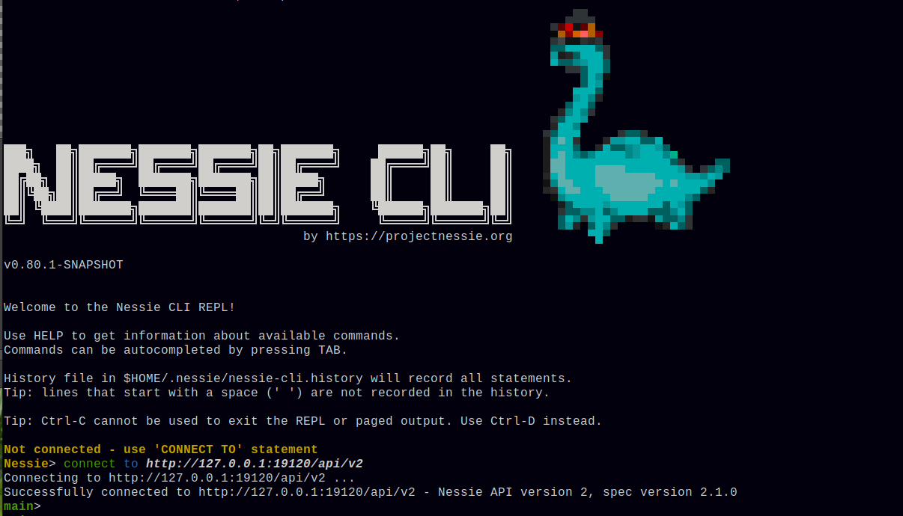

# New Nessie CLI tool

There is a new CLI tool for Nessie, replacing the old Python based CLI.
<!-- more -->

`pynessie` was _the_ command line tool when working against Nessie from
a command line. It exists since the early days of Nessie.  Since then,
`pynessie` did not change very much and is still using the Nessie REST
API v1, which is deprecated and will be removed at some point.
`pynessie` also does not have support for the more complex OAuth2
device-code and authorization-code flows. 

We were thinking about how to deal with a CLI tool for Nessie,
considering a bunch of options and choices:

## Functionalities and Features of the new Nessie CLI so far

* It has a SQL-ish syntax.
* It's a REPL.
* It has built-in online `HELP` command (and `HELP <command>` command ;),
  that also shows the commands' syntaxes in the online help. The same
  information is also published on the projectnessie.org site.
* Auto-completion of commands, keywords and reference names (use TAB).
* Syntax highlighting (ugh - colors!).
* Paging of long results - showing a lot of content keys or a long commit
  log just works like `less` on your Linux or macOS box.
* Command history, persisted in your home directory (can be turned off).
* "Just" run a one or more Nessie REPL commands - pass those as arguments
  on the command line or as a script.
* It's small! Currently just ~14.5MB - not bad for a fully functional
  REPL.
* Available commands to manage branches and tags, drop tables and views,
  manage namespaces, list and show tables & views, merge and help.

## Shall we continue with Python or use Java?

You may say: Python, that's it! Much easier to run! With _easier_
people usually think of "just running it" from bash or zsh. But is
it really easier to run? You have to setup a virtual-env and have the
(right) Python version in place.

Dependency management in Python is (at least from our perspective)
not an easy thing. API compatibility between versions of the
dependencies is not always maintained.

TL;DR we think, there's not really a benefit from using Python.

## Feature "parity"

`pynessie`, since written in Python, requires that we duplicate
everything (Nessie REST API model classes, REST calls, 
authentication mechanisms, also OAuth2 flows) - resulting in a
duplicate engineering effort. It's more work to do all that in
Python.

## REPL?

Having a REPL for the Nessie CLI, including a "scripting language",
would be cool, no? pynessie does not have that.

## Tool startup time

Admittedly, pynessie starts pretty quickly. However, nowadays
Java tools start up pretty quick as well - if done right, you'll
not notice, especially for an interactive tool (think: REPL).

## What about the `nessie-content-generator` tool?

That tool was, as the name suggests, a tool to generate dummy
content in Nessie for testing purposes. It's never really been
meant to be used as a CLI replacement.

`nessie-content-generator` is relatively easy to use - so there
is some risk that you generate a lot of "broken" content in a
production Nessie repository, maybe not the best thing.

## Java it is!

We decided to go with Java, we have all the libraries that we need:

* picocli is really neat for command line options et al
* jline + jansi is a really cool library combination when working
  with terminals - colors, REPL tool functionality, command history,
  etc.
* Nessie client - we already have a fully featured client for Java
  that also already supports all the OAuth2 flows, including
  device-code and authorization-code.

## Do we want Quarkus to run the CLI/REPL?

Sure, Quarkus offers a lot of things, but there's nothing we really
need - it can't even "eliminate" dead code for us, because nothing
in the Nessie Java client uses CDI.

Also, with Quarkus we'd have to require Java 17, but requiring "just"
Java 11 is probably nicer. So we don't use Quarkus.

BTW: It also saves ~4MB in the uber-jar, and a couple dozen
milliseconds startup time.

## Future of `pynessie`

Finally, you may ask what will happen with `pynessie`: we will retain
it as long as we support Nessie REST API v1. We may decide to drop the
CLI part of `pynessie` and make it a pure Python client for Nessie -
no final decision has been made yet.

