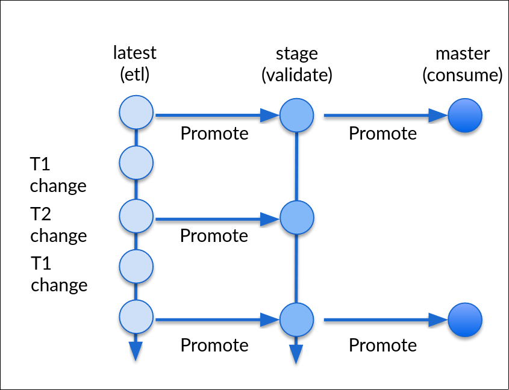

# Branching in Nessie

The below diagram is an example of the most common model for branching in Nessie. For a complete description of the 
commit model see: [Spec](spec.md).

As with git it is expected that all Nessie branches start from `master`. The branching model should always maitain a 
linear history for `master`. By default Nessie tries to maintain consistency at a database level, as such if two branches
from a common ancestor diverge they will conflict and won't be able to be merged without forcing (deleting history) or 
cherry-picking (explicitly deciding what changes are non-overlapping).

Master is treated as the `gold` source and is the default branch that normal consumers would read from. Reads for a
particular commit (bare branch) are consistent and always produce the same results however reads for a branch are not
neccessarily consistent if the branch has changed and the client explicitly updates the branch.

## Typical workflow
1. create latest and stage branches - At this stage all three branches point to the same commit and reading off each
would produce the same result.
2. commits are performed against `latest` branch. This has no effect on readers for `stage` or `master` branch.
3. commit (T2) is merged to `stage` branch from `latest` branch. This succeeds as they both have a common ancestor.
4. Readers are free to validate from the `stage` branch. In this case an exception is found and the `stage` branch is
not merged into `master`
5. commits on the `latest` branch to fix the exception above. Again these don't affect other readers
6. merge from `latest` to `stage` again and verify. Because of the linear history this merge succeeds
7. Validation succeeds and the readers on `master` can now see the *validated* changes performed on the `latest` branch
8. The `latest` and `stage` branch could be deleted or could live in perpetuity. Deleting is easier as there are fewer
merge conflict potentials in the future. This is similar to the git model.

## Conflicts and consistency
This straightforward model does not come with any conflicts or consistency issues. In real life we will expect to see
consistency issues crop up more often. If two ETL branches were created to upgrade different parts of the database the
etl writers will have to manage merges and cherry-picks to ensure both sets of changes land in master. This is not
terribly different from the process of merging changes from multiple branches in a git project. However large changes:
eg deleting records across partitions for privacy considerations or multi-table schema changes are expensive operatoins
and having to 'rebase' them onto branches that have seen several other changes may require effectively re-performing the
expensive operations. Currently Nessie does not serialize the operations taking place, only the end state of an
operation so Nessie alone can't reconstruct a change or reapply it consistently. This may require some form of
pessimistic locking in the future. *todo* say more on this topic

## Isolation levels
*todo*
