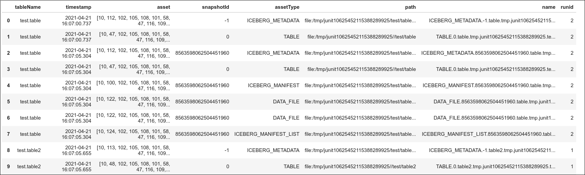

# Management Services

Nessie can and needs to manage several operations within your data lake. Each management
service can be scheduled and Nessie reports the outcome of each scheduled operation.
Scheduled operations require that Nessie have access to a Spark cluster to complete
those operations and many of them are distributed compute operations.

## Garbage Collection

Since Nessie is maintaining many versions of metadata and data-pointers simultaneously,
you must rely on Nessie to clean up old data. Nessie calls this garbage collection.

There are at least two steps to a garbage collection action. The first steps are instructive, and the last step is destructive.

!!! info
    currently the GC algorithm only works for Iceberg tables and Dynamo as a backend

### Identify Unreferenced Assets

This is a spark job which should be run periodically to identify no longer referenced assets. Assets are defined as the set of
files, records, entries etc that make up a table, view or other Nessie object. For example, iceberg assets are:
 * manifest files
 * manifest lists
 * data files
 * metadata files
 * the entire table directory on disk (if it is empty)

To be marked as unreferenced an asset must either be:
 1. No longer referenced by any branch or tag. For example, an entire branch was deleted, and a table on that branch is no longer accessible.
 2. Assets created in a commit which has passed the (configurable) commit age. *If they are not referenced by newer commits*

Identifying unreferenced assets is a non-destructive action. The result of the spark job is a Spark DataFrame of all the
unreferenced assets. This dataframe is stored in an iceberg table managed by nessie at a configurable key. This table is
referencable in Nessie so can be examined via Spark or any other Nessie/Iceberg compatible engine. An example of the table output
is shown below.



This action is designed to run concurrently to normal operational workloads and can/should be run regularly. This table is used as input
into the destructive GC operation described below.

#### Configuration and running
GcActionsConfig actionsConfig, GcOptions gcConfig, TableIdentifier table
The relevant configuration items are:
| parameter | default value | description |
|---|---|---|
| table | `null` | The Iceberg `TableIdentifier` to which the unreferenced assets should be written |
| GcOptions.getBloomFilterCapacity | 10000000 | Size (number of items) of bloom filter for identification of referenced values |
| GcOptions.getMaxAgeMicros | 7 days | age at which a commit starts to expire |
| GcOptions.getTimeSlopMicros | 1 day | minimum age a values can be before it will be considered expired |
| GcActionsConfig.getDynamoRegion | provider default | AWS Region of the Nessie DynamoDB |
| GcActionsConfig.getDynamoEndpoint | provider default | Custom AWS endpoint of the Nessie DynamoDB |
| GcActionsConfig.getStoreType | DYNAMO | only backend which supports GC |

Running the action can be done simply by:
```java
    GcActionsConfig actionsConfig = GcActionsConfig.builder().build(); //use all defaults
    GcOptions gcOptions = GcOptions.builder().build(); //use all defaults
    GcActions actions = new GcActions.Builder(spark)
                                     .setActionsConfig(actionsConfig)
                                     .setGcOptions(gcOptions)
                                     .setTable(TABLE_IDENTIFIER).build(); // (1)
    Dataset<Row> unreferencedAssets = actions.identifyUnreferencedAssets(); // (2)
    actions.updateUnreferencedAssetTable(unreferencedAssets); // (3)
```
The first step above builds the action with known configs. Step 2 generates a DataFrame of unreferenced assets and
Step 3 writes it as an iceberg table.

### Delete Unreferenced Assets

The destructive garbage collection step is also a Spark job and takes as input the table that has been built above. This job
is modelled as an Iceberg Action and has a similar API to the other Iceberg Actions. In the future it will be registered with
Iceberg's Action APIs and callable via Iceberg's custom [SQL statements](http://iceberg.apache.org/spark-procedures/).

This Iceberg Action looks at the generated table from the [Identify](#identify-unreferenced-assets) step and counts the number of times a distinct asset has been
seen. Effectively it performs a group-by and count on this table. If the count of an asset is over a specified threshold **AND** it
was seen in the last run of the [Identify](#identify-unreferenced-assets) stage it is collectable. This asset is then deleted permanently. A report table of
deleted object is returned to the user and either the records are removed from the 'identify' table or the whole table is purged.

#### Configuration and running

The relevant configuration items are:
| parameter | default value | description |
|---|---|---|
| seenCount | 10 | How many times an asset has been seen as unreferenced in order to be considered for deletion |
| deleteOnPurge | true | Delete records from the underlying iceberg table of unreferenced assets |
| dropGcTable | true | Drop the underlying iceberg table or attempt to clean only the missing rows |
| table | `null` | The iceberg `Table` which stores the list of unreferenced assets |

Running the action can be done simply by:

```java
    Table table = catalog.loadTable(TABLE_IDENTIFIER);
    GcTableCleanAction.GcTableCleanResult result = new GcTableCleanAction(table, spark).dropGcTable(true).deleteCountThreshold(2).deleteOnPurge(true).execute();
```
The above snippet assumes a `TABLE_IDENTIFIER` which points to the unreferenced assets table. It also requires an active
spark session and a nessie owned `Catalog`. The `result` object above returns the number of files the action tried to delete and the number that failed.

!!! note
    You can follow along an interactive demo in a [Jupyter Notebook via Google Colab](https://colab.research.google.com/github/projectnessie/nessie-demos/blob/main/colab/nessie-iceberg-demo-nba.ipynb)
    or in a [Jupyter Notebook via Binder](https://mybinder.org/v2/gh/projectnessie/nessie-demos/main?filepath=colab%2Fnessie-iceberg-demo-nba.ipynb).
    
    Detailed steps on how to set up Pyspark + Iceberg + Nessie with Python is available on
    [Colab](https://colab.research.google.com/github/projectnessie/nessie-demos/blob/main/colab/nessie-iceberg-spark-setup.ipynb)
    and [Binder](https://mybinder.org/v2/gh/projectnessie/nessie-demos/main?filepath=colab%2Fnessie-iceberg-spark-setup.ipynb)

### Internal Garbage collection

Currently the only garbage collection algorithm available is on the values and assets in a Nessie database only. The
internal records of the Nessie Database are currently not cleaned up. Unreferenced objects stored in Nessie's internal
database will be persisted forever currently. A future release will also clean up internal Nessie records if they are unreferenced.

## Time-based AutoTagging

!!! info
  This service is currently in progress and is not yet included in a released version of Nessie.

Nessie works against data based on a commit timeline. In many situations, it is useful
to capture historical versions of data for analysis or comparison purposes. As such,
you can configure Nessie to AutoTag (and auto-delete) using a timestamp based naming scheme.
When enabled, Nessie will automatically generate and maintain tags based on time
so that users can refer to historical data using timestamps as opposed to commits.
This also works hand-in-hand with the Nessie garbage collection process by ensuring
that older data is "referenced" and thus available for historical analysis.

Currently there is one AutoTagging policy. By default, it creates the following tags:

* Hourly tags for the last 25 hours
* Daily tags for the last 8 days
* Weekly tags for the last 6 weeks
* Monthly tags for the last 13 months
* Yearly tags for the last 3 years

Tags are automatically named using a `date/` prefix and a zero-extended underscore based naming scheme.
For example: `date/2019_09_07_15_50` would be a tag for August 7, 2019 at 3:50pm.

!!! warning
    AutoTags are automatically deleted once the policy rolls-over. As such, if retention is desired post roll-over, manual tags should be created.

AutoTagging is currently done based on the UTC roll-over of each item.

## Manifest Reorganization

!!! info
This service is currently in progress and is not yet included in a released version of Nessie.

Rewrites the manifests associated with a table so that manifest files are organized
around partitions. This extends on the ideas in the Iceberg [`RewriteManifestsAction`](http://iceberg.apache.org/javadoc/0.11.0/org/apache/iceberg/actions/RewriteManifestsAction.html).

!!! note
    Manifest reorganization will show up as a commit, like any other table operation.

Key configuration parameters:

|Name|Default|Meaning|
|-|-|-|
|effort|medium|How much rewriting is allowed to achieve the goals|
|target manifest size|8mb|What is the target|
|partition priority|medium|How important achieving partition-oriented manifests.|

## Compaction

!!! info
This service is currently in progress and is not yet included in a released version of Nessie.

Because operations against table formats are done at the file level, a table can start
to generate many small files. These small files will slow consumption. As such, Nessie
can automatically run jobs to compact tables to ensure a consistent level of performance.

|Name|Default|Meaning|
|-|-|-|
|Maximum Small Files|10.0|Maximum number of small files as a ratio to large files|
|Maximum Delete Files|10.0|Maximum number of delete tombstones as a ratio to other files before merging the tombstones into a consolidated file|
|Small File Size|100mb|Size of file before it is considered small|
|Target Rewrite Size|256mb|The target size for splittable units when rewriting data.|

!!! note
    Compaction will show up as a commit, like any other table operation.
