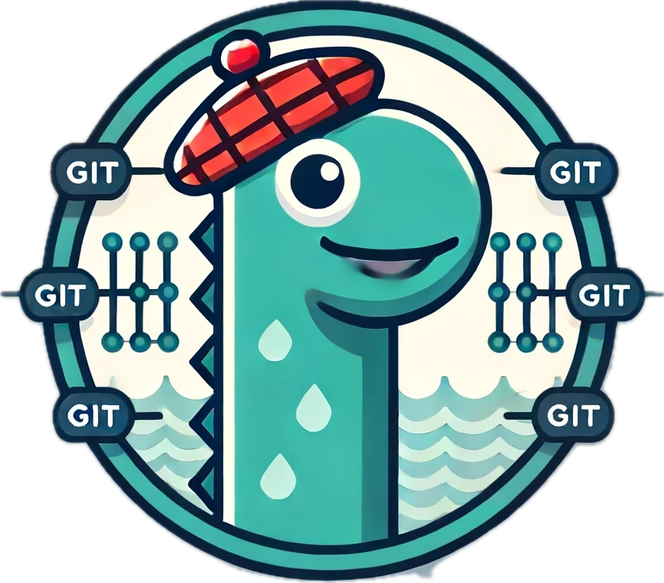

# Overview

Nessie is an OSS service and libraries that enable you to maintain multiple versions 
of your data and leverage Git-like Branches & Tags for your Data Lake. Nessie enhances the 
Apache Iceberg table format with version control techniques!

* [Try Nessie with Iceberg REST](./try-nessie.md)
* [Configure Nessie with Iceberg REST](./iceberg-rest.md)
* [About Nessie](./about.md)
* [Introduction](./introduction.md)
* And the other guides

For more production-like information, please refer to the

* [Kubernetes Guide](./kubernetes.md)
* [Configuration reference](../nessie-latest/index.md)
