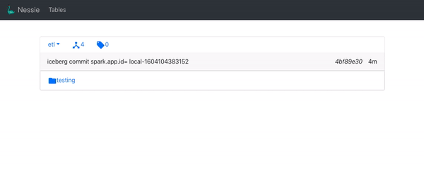

# Web UI

Nessie comes with a simple web ui that allows you to understand what is in your Nessie
repository. You can view existing tags and branches as well as the content within them.

The UI automatically runs as part of starting the Nessie service. If running locally, 
you can find the UI at [localhost:19120](http://localhost:19120/).

{.bordered}

### Swagger UI

The Swagger UI rest api test UI can also be found running in the service. It is located 
at  [localhost:19120/q/swagger-ui](http://localhost:19120/q/swagger-ui/).
